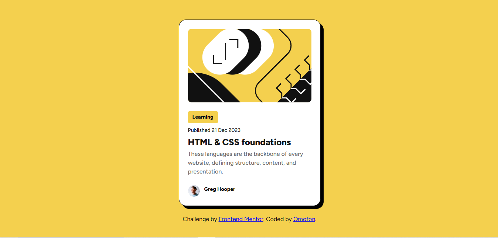

# Frontend Mentor - Blog preview card solution

This is a solution to the [Blog preview card challenge on Frontend Mentor](https://www.frontendmentor.io/challenges/blog-preview-card-ckPaj01IcS). Frontend Mentor challenges help you improve your coding skills by building realistic projects.

## Table of contents

- [Overview](#overview)
  - [The challenge](#the-challenge)
  - [Screenshot](#screenshot)
  - [Links](#links)
- [My process](#my-process)
  - [Built with](#built-with)
  - [What I learned](#what-i-learned)
  - [Continued development](#continued-development)
- [Author](#author)

## Overview

### The challenge

Users should be able to:

- See hover and focus states for all interactive elements on the page
- View the optimal layout for the card on different screen sizes

### Screenshot



### Links

- Solution URL: [GitHub Project](https://github.com/omofon/Frontend-Mentor-Challenges/tree/72926256849362392c665abcaaad553ff316efa0/Blog%20Preview%20Card)
- Live Site URL: [Live Site](https://frontend-mentor-challenges-henna-two.vercel.app/)

## My process

I took reference from the styling in the figma file to work on this.

### Built with

- Semantic HTML5 markup
- CSS custom properties
- Flexbox
- Mobile-first workflow
- Google Fonts (Figtree font family)
- CSS media queries for responsive design

### What I learned

This project helped me practice several important frontend concepts:

**CSS Custom Properties**: I implemented a clean design system using CSS variables for colors, spacing, and typography, making the code more maintainable and consistent.

```css
:root {
  --color-yellow: hsl(47, 88%, 63%);
  --color-white: hsl(0, 0%, 100%);
  --spacing-24: 24px;
}
```

**Box Shadow for Depth**: I created a distinctive card appearance using a solid box shadow that gives the design a modern, bold look.

```css
.card {
  box-shadow: 8px 8px 0 rgb(0, 0, 0);
  border: 1px solid var(--color-gray-950);
}
```

**Hover States**: Implemented an interactive hover effect on the title that changes color, enhancing user experience.

```css
.title:hover {
  color: var(--color-yellow);
  cursor: pointer;
}
```

**Responsive Design**: Used media queries to adjust font sizes and card width for smaller screens, ensuring the design works well on mobile devices.

### Continued development

In future projects, I want to focus on:

- Adding smooth transitions and animations to hover states
- Exploring more advanced CSS Grid layouts
- Implementing accessibility features like proper ARIA labels
- Practicing with more complex responsive design patterns
- Experimenting with CSS transforms for interactive effects

## Author

- Website - [Omofon](http://github.com/omofon)
- Frontend Mentor - [@omofon](https://www.frontendmentor.io/profile/omofon)
- GitHub - [@omofon](https://github.com/omofon)
