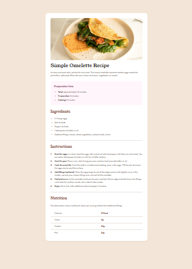

# Frontend Mentor - Recipe page solution

This is a solution to the [Recipe page challenge on Frontend Mentor](https://www.frontendmentor.io/challenges/recipe-page-KiTsR8QQKm). Frontend Mentor challenges help you improve your coding skills by building realistic projects.

## Table of contents

- [Overview](#overview)
  - [Screenshot](#screenshot)
  - [Links](#links)
- [My process](#my-process)
  - [Built with](#built-with)
  - [What I learned](#what-i-learned)
  - [Continued development](#continued-development)
  - [Useful resources](#useful-resources)
- [Author](#author)

## Overview

### Screenshot



### Links

- Solution URL: [GitHub Repository](https://github.com/omofon/Frontend-Mentor-Challenges/tree/5d9b61c76f4b79816ccddb195af015a5efdb0cbe/Recipe%20Page)
- Live Site URL: [Live Demo](https://frontend-mentor-challenges-j4jp.vercel.app/)

## My process

### Built with

- Semantic HTML5 markup
- CSS custom properties (CSS variables)
- Flexbox
- CSS positioning for custom list markers
- Mobile-first responsive design
- Google Fonts (Outfit & Young Serif)

### What I learned

This project helped me solidify several important CSS concepts:

**1. Using CSS Custom Properties for Maintainable Color Schemes**

```css
:root {
  --white: hsl(0, 0%, 100%);
  --stone-100: hsl(30, 54%, 90%);
  --brown-800: hsl(14, 45%, 36%);
  --rose-800: hsl(332, 51%, 32%);
}
```

Using CSS variables made it easy to maintain consistent colors throughout the design and would make theme switching straightforward in the future.

**2. Custom List Markers with ::before Pseudo-elements**

```css
.prep-time ul li::before {
  content: "▪";
  color: var(--rose-800);
  position: absolute;
  left: 0.5rem;
}
```

Instead of relying on default list styling, I used `::before` pseudo-elements to create custom bullet points with precise color control and positioning.

**3. CSS Counters for Numbered Lists**

```css
.instructions ol {
  counter-reset: instruction-counter;
}

.instructions ol li::before {
  content: counter(instruction-counter) ".";
  counter-increment: instruction-counter;
}
```

This approach gave me complete control over the styling of numbered lists, allowing me to match the design perfectly.

**4. Responsive Design Without Media Query Complexity**

```css
.recipe-card {
  max-width: 46rem;
  width: 100%;
  margin: 0 1rem;
}
```

Using flexible units and `max-width` meant the design naturally adapted to different screen sizes, with media queries only needed for layout-specific adjustments.

### Continued development

In future projects, I want to focus on:

- **Accessibility improvements** - Adding ARIA labels, ensuring proper heading hierarchy, and testing with screen readers
- **CSS Grid layouts** - While this project used Flexbox, I want to explore more complex Grid-based layouts
- **Animation and transitions** - Adding subtle hover effects and micro-interactions to enhance user experience
- **CSS container queries** - Exploring modern responsive design patterns beyond traditional media queries

### Useful resources

- [MDN Web Docs - CSS Counters](https://developer.mozilla.org/en-US/docs/Web/CSS/CSS_Counter_Styles/Using_CSS_counters) - Helped me understand how to implement custom numbered lists
- [CSS-Tricks - Custom List Styles](https://css-tricks.com/custom-list-number-styling/) - Great reference for styling list markers
- [Josh Comeau's CSS Reset](https://www.joshwcomeau.com/css/custom-css-reset/) - Influenced my approach to CSS resets and defaults
- [Every Layout](https://every-layout.dev/) - Taught me principles for creating flexible, responsive layouts

## Author

- GitHub - [@omofon](https://github.com/omofon)
- Frontend Mentor - [@omofon](https://www.frontendmentor.io/profile/omofon)
- Website - [omofon.dev](https://omofon.github.io)

---

**Note:** This project is part of my journey learning frontend development. Feedback and suggestions are always welcome!
