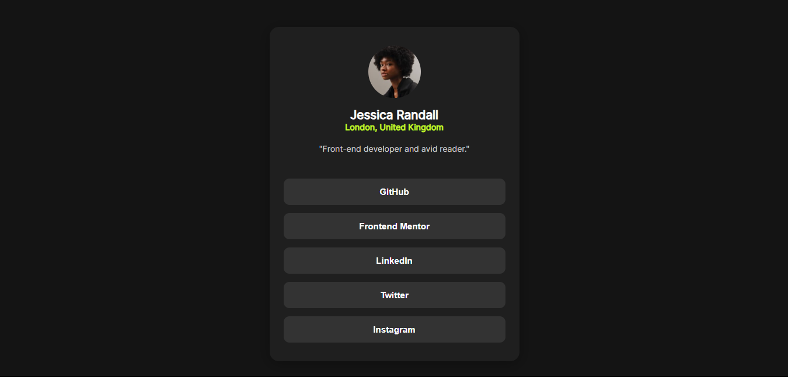
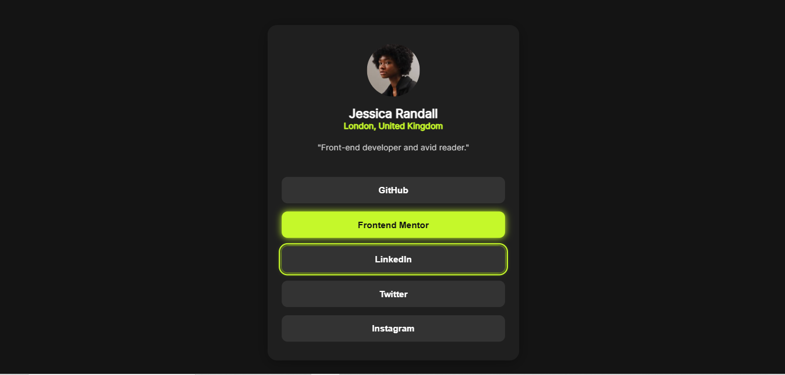

# Frontend Mentor - Social links profile solution

This is a solution to the [Social links profile challenge on Frontend Mentor](https://www.frontendmentor.io/challenges/social-links-profile-UG32l9m6dQ). Frontend Mentor challenges help you improve your coding skills by building realistic projects.

## Table of contents

- [Overview](#overview)
  - [The challenge](#the-challenge)
  - [Screenshot](#screenshot)
  - [Links](#links)
- [My process](#my-process)
  - [Built with](#built-with)
  - [What I learned](#what-i-learned)
  - [Continued development](#continued-development)
- [Author](#author)

## Overview

### The challenge

Users should be able to:

- See hover and focus states for all interactive elements on the page
- View the optimal layout depending on their device's screen size

### Screenshots

- Preview
  

- With hover and active styling
  

### Links

- [GitHub Repo](https://github.com/omofon/Frontend-Mentor-Challenges/tree/96bde5243e538ec4d47a974770c3e45e256c6e39/Social%20Links%20Profile)
- [Live Site URL](https://frontend-mentor-six-gold.vercel.app/)

## My process

### Built with

- Semantic HTML5 markup
- CSS custom properties
- Flexbox
- Mobile-first workflow
- CSS transitions and transforms
- Accessible focus states

### What I learned

Working through this project helped me reinforce several key concepts:

**CSS Custom Properties for Theme Management**

```css
:root {
  --green: hsl(75, 94%, 57%);
  --grey-700: hsl(0, 0%, 20%);
  --grey-800: hsl(0, 0%, 12%);
  --grey-900: hsl(0, 0%, 8%);
}
```

Using CSS variables made it easy to maintain a consistent color scheme throughout the project and would make future theme adjustments simple.

**Accessible Interactive States**

```css
.links button:focus {
  outline: 2px solid var(--green);
  outline-offset: 3px;
  box-shadow: 0 0 8px var(--green);
}
```

I learned the importance of creating visible focus states for keyboard navigation, ensuring the component is accessible to all users.

**Smooth Hover Transitions**

```css
.links button:hover {
  background: var(--green);
  color: var(--grey-900);
  box-shadow: 0 0 12px var(--green);
}
```

Adding the glowing effect on hover created a more engaging and polished user experience.

### Continued development

In future projects, I want to focus on:

- **JavaScript functionality** - Adding actual link navigation and possibly tracking interactions
- **Advanced animations** - Exploring more complex animation libraries like Framer Motion
- **Component reusability** - Converting this into a reusable React component
- **Dark/Light mode toggle** - Implementing theme switching capabilities

## Author

- Website - [GitHub](https://github.com/omofon)
- Frontend Mentor - [@omofon](https://www.frontendmentor.io/profile/omofon)
- Twitter - [@omofzzz](https://x.com/omofzzz)
