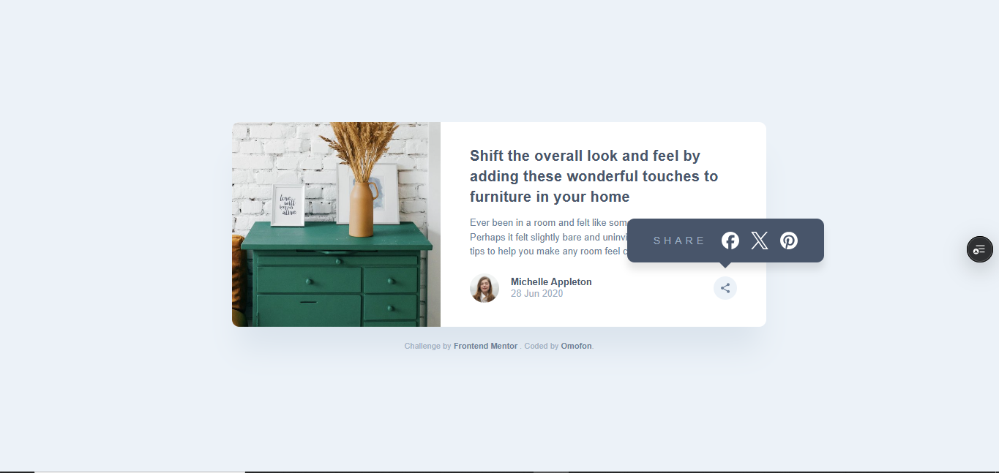
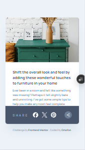

# Frontend Mentor | Article Preview Component


## 🔗 Links

- **Live Site:** [https://article-card-iota.vercel.app/](https://article-card-iota.vercel.app/)
- **Solution:** [Frontend Mentor Solution](https://t.co/MIGvg87Hfh)
- **Repository:** [GitHub](https://github.com/omofon/Personal-Projects/tree/8a6b33b4fb1fbab592a6f1f21a2950b66c9f2333/Frontend%20Mentor/article-preview-component-master)

## 📋 Challenge

Build a responsive article card with a share tooltip that adapts between desktop (floating popup) and mobile (full-width bar). Users should see optimal layouts across devices and interact with a functional share menu.

## 🎯 What I Built

A pixel-perfect article preview card with context-aware share functionality—desktop users get an elegant floating tooltip, mobile users get a native-feeling bottom sheet. The real challenge wasn't the UI; it was managing CSS positioning contexts to achieve both behaviors with a single DOM element.

## 🖼️ Screenshots

| Desktop Active State | Mobile Active State |
|:---:|:---:|
|  |  |

## 🛠️ Built With

- Semantic HTML5 (`<article>`, `<time>`, proper heading hierarchy)
- CSS Flexbox for component layout
- CSS Custom Properties for maintainable theming
- Vanilla JavaScript (no frameworks—intentional practice with fundamentals)
- Mobile-first responsive design with strategic media queries

## 💡 Key Technical Decisions

### The Positioning Problem

The core challenge: a tooltip that's **absolutely positioned within a small parent** on desktop needs to **span the full width of a larger parent** on mobile—using the same HTML structure.

**Solution:** CSS positioning context manipulation via media queries.

```css
/* Desktop: tooltip positioned relative to avatar container */
.avatar-container {
    position: relative;
}

.share-tooltip {
    position: absolute;
    bottom: -70px;
    right: -80px;
    /* Floating tooltip styles */
}

/* Mobile: break out of parent, use grandparent as reference */
@media (max-width: 768px) {
    .avatar-container {
        position: static; /* Remove positioning context */
    }
    
    .content-container {
        position: relative; /* Become new positioning parent */
    }
    
    .share-tooltip {
        position: absolute;
        bottom: 0;
        left: 0;
        width: 100%; /* Full-width bar */
        /* Bottom sheet styles */
    }
}
```

**Why this matters:** Most juniors would add conditional rendering or duplicate markup. This approach keeps the DOM clean and leverages CSS's power properly. One element, two behaviors, zero JS logic for layout.

### Event Handling Architecture

Implemented a robust click-outside pattern without heavyweight libraries:

```javascript
shareBtn.addEventListener("click", (e) => {
    e.stopPropagation(); // Prevent immediate close
    tooltip.classList.toggle("active");
});

// Close on outside clicks
document.addEventListener("click", () => {
    tooltip.classList.remove("active");
});

// Prevent tooltip clicks from bubbling
tooltip.addEventListener("click", (e) => {
    e.stopPropagation();
});
```

**Alternative considered:** Adding/removing the document listener conditionally. Rejected because the always-on listener is simpler and has negligible performance impact—premature optimization would've complicated the code.

## 📈 What I Learned

1. **Positioning contexts are stackable boundaries.** Understanding when to use `static` to "remove" a boundary completely changed how I approach responsive layout transforms.

2. **Event propagation is a design tool.** Instead of checking click targets manually, `stopPropagation()` creates clean boundaries for interactive components.

3. **CSS media queries can fundamentally alter component behavior**, not just resize things. The mobile version isn't a "smaller desktop view"—it's a different UX pattern achieved purely through CSS.

## 🚀 Future Improvements

- **Accessibility pass:** Add ARIA attributes (`aria-expanded`, `aria-controls`), ensure keyboard navigation works (Tab to share button, Escape to close), manage focus trap when tooltip is open
- **Micro-interactions:** CSS transitions on tooltip appearance (slide-up on mobile, fade + scale on desktop)
- **Share functionality:** Wire up actual Web Share API for mobile, fallback to clipboard copy

## 🏗️ Project Structure

```
article-preview-component/
├── design/               # Reference designs
├── images/              # Component images and icons
├── screenshots/         # Solution screenshots
├── index.html          # Semantic markup
├── style.css           # Component styles
├── style-guide.md      # Design specs
└── index.js            # Toggle interaction
```

## 👤 Author

- Frontend Mentor: [@omofon](https://www.frontendmentor.io/profile/omofon)
- GitHub: [@omofon](https://github.com/omofon)

---

**Note to reviewers:** This was intentionally built without frameworks to practice vanilla fundamentals. The positioning solution represents real problem-solving over just following tutorials.