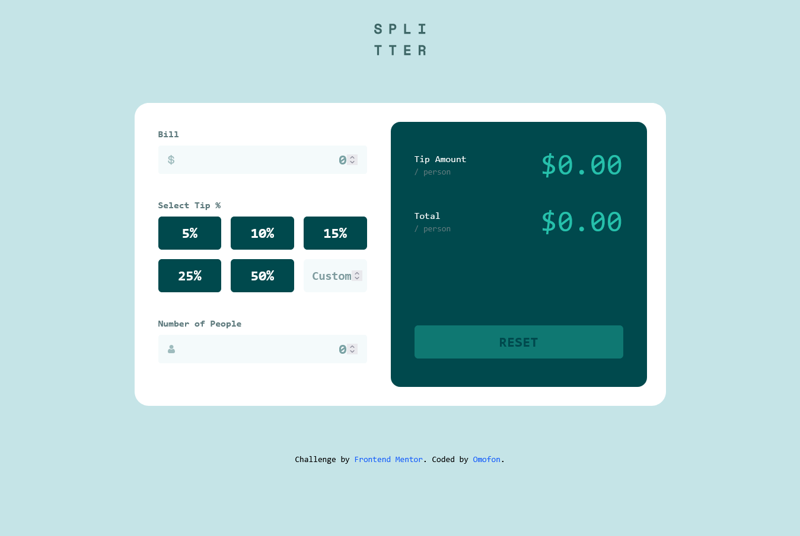

# Tip Calculator App

A responsive tip calculator built with vanilla JavaScript and Tailwind CSS v4. Calculate tips and split bills with a clean, intuitive interface that works seamlessly across all devices.



## 🔗 Links

- **Live Site**: [splitter-wheat.vercel.app](https://splitter-wheat.vercel.app)
- **Repository**: [GitHub](https://github.com/omofon/Personal-Projects/tree/9da7ee5d08e4d650075ea441fb865abbd358185f/Frontend%20Mentor/tip-calculator-app-main)
- **Challenge**: [Frontend Mentor](https://www.frontendmentor.io/challenges/tip-calculator-app-ugJNGbJUX)

## ✨ Features

- **Real-time Calculations**: Instant tip and total per person calculations as you type
- **Preset Tip Options**: Quick selection buttons for 5%, 10%, 15%, 25%, and 50% tips
- **Custom Tip Input**: Enter any custom tip percentage
- **Input Validation**: Error handling for invalid inputs (zero people, negative values)
- **Responsive Design**: Mobile-first approach with optimized layouts for tablet and desktop
- **Accessible**: Semantic HTML, proper ARIA labels, and keyboard navigation support

## 🛠️ Built With

- **HTML5**: Semantic markup
- **CSS**: Tailwind CSS v4 with custom theme configuration
- **JavaScript**: Vanilla JS, no frameworks
- **Font**: Space Mono (Google Fonts)
- **Deployment**: Vercel

## 📁 Project Structure

```
tip-calculator-app-main/
├── design/
│   └── screenshot.png
├── images/
│   ├── favicon-32x32.png
│   ├── icon-dollar.svg
│   ├── icon-person.svg
│   └── logo.svg
├── src/
    ├── output.css          # Compiled Tailwind CSS
│   └── style.css           # Tailwind source with custom theme
├── index.html              # Main HTML file
├── index.js                # JavaScript logic
├── package.json
└── README.md
```

## 🚀 Getting Started

### Prerequisites

- Node.js (for Tailwind CSS CLI)
- A modern web browser

### Installation

1. Clone the repository:
```bash
git clone https://github.com/omofon/Personal-Projects.git
cd "Frontend Mentor/tip-calculator-app-main"
```

2. Install dependencies:
```bash
npm install
```

3. Build CSS:
```bash
npm run build
```

4. Open `index.html` in your browser or use a local server:
```bash
npx serve
```

### Development

To rebuild CSS after making style changes:
```bash
npm run build
```

The compiled CSS outputs to the current directory (`./output.css`).

## 💡 What I Learned

### Tailwind CSS v4 Theme Configuration
Migrated from v3 to v4, utilizing the new `@theme` directive for custom color variables:
```css
@theme {
  --color-primary: hsl(172, 67%, 45%);
  --color-primary-dark: hsl(183, 100%, 15%);
}
```

### Real-time Input Validation
Implemented event-driven validation that provides immediate feedback without form submission:
```javascript
numPeopleInput.addEventListener("input", () => {
  if (parseFloat(numPeopleInput.value) === 0) {
    showError(peopleError, "Can't be zero");
  } else {
    hideError(peopleError);
  }
});
```

### State Management Without Frameworks
Built a simple but effective state management pattern using plain JavaScript:
- Centralized calculation logic
- Event delegation for tip button selection
- Proper cleanup and reset functionality

## 🎯 Challenges Overcome

1. **Button vs Input Toggle Logic**: Initially struggled with managing active states between preset tip buttons and custom input. Solved by implementing mutual exclusivity with clear state management.

2. **Decimal Precision**: Learned to handle floating-point arithmetic issues in JavaScript when dealing with currency calculations using `toFixed()` and `parseFloat()`.

3. **Responsive Grid Layout**: Achieved a 2-column mobile, 3-column desktop grid for tip buttons using Tailwind's responsive utilities without media query hell.

## 📱 Responsive Breakpoints

- **Mobile**: < 768px (2-column tip grid)
- **Tablet**: 768px - 1024px
- **Desktop**: > 1024px (3-column tip grid, horizontal layout)

## 🔮 Future Improvements

- [ ] Add bill splitting history with localStorage persistence
- [ ] Implement currency selector (USD, EUR, GBP, etc.)
- [ ] Add dark mode toggle
- [ ] Create shareable bill links
- [ ] Add animation to calculation updates
- [ ] Implement keyboard shortcuts (Enter to calculate, Escape to reset)

## 👤 Author

- **GitHub**: [@omofon](https://github.com/omofon)
- **Frontend Mentor**: [@omofon](https://www.frontendmentor.io/profile/omofon)

## 📄 License

This project is part of Frontend Mentor's free challenges. Feel free to use this code for learning purposes.

## 🙏 Acknowledgments

- Challenge provided by [Frontend Mentor](https://www.frontendmentor.io)
- Design specs and assets from Frontend Mentor
- Font: Space Mono by Google Fonts