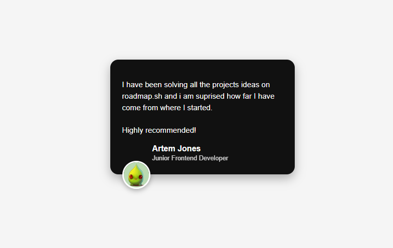

# Testimonial Card (Roadmap.sh Project)

A simple testimonial card component built with **HTML** and **CSS**.  
This project is part of the [roadmap.sh frontend projects](https://roadmap.sh/projects) series, designed to practice CSS fundamentals such as **box-shadow, flexbox, positioning, and card layouts**.

---

## 📌 Features

- Clean and minimal testimonial card design
- Uses `box-shadow` for depth
- Custom avatar styling with circular borders and shadows
- Author section with name and role
- Fully responsive layout (centered with flexbox)

---

## 🛠️ Technologies

- HTML5
- CSS3 (Flexbox, Shadows, Border Radius)

---

## 📂 Project Structure

```
├── index.html       # Main file
├── style.css        # Stylesheet
└── avatars/         # Folder containing profile images
```

---

## 🚀 Usage

1. Clone this repository:

   ```bash
   git clone https://github.com/omofon/Personal-Projects/tree/172be7f90b1cec00df7cd27e851216aea1ef07f1/Roadmap%20Projects/Frontend/05%20Testimonial%20Card.git
   ```

2. Navigate into the folder:

   ```bash
   cd testimonial-card
   ```

3. Open `index.html` in your browser.

---

## 🎨 Final Preview


