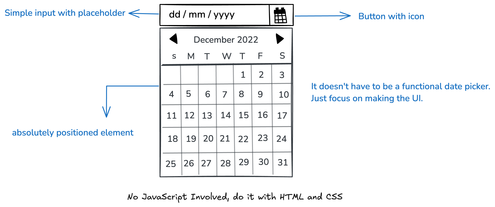
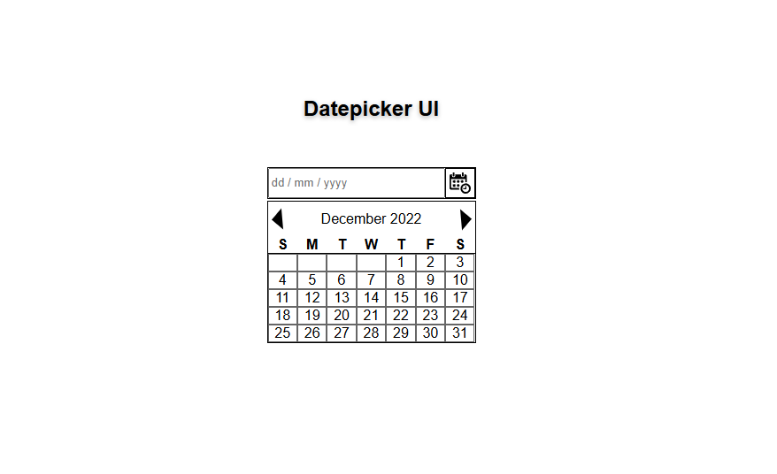

# Datepicker UI

A clean and intuitive datepicker component built with HTML and CSS. This project is part of the [roadmap.sh](https://roadmap.sh/projects/datepicker-ui) frontend projects.

### Preview from Roadmap.sh



### Result



## Project Overview

This datepicker UI provides a user-friendly interface for selecting dates. The component features a text input field with date format placeholder, a calendar icon button, navigation arrows for month/year selection, and a calendar grid displaying all days of the selected month.

## Features

- **Date Input Field**: Text input with `dd / mm / yyyy` placeholder format
- **Calendar Icon Button**: Interactive button with hover and active states
- **Month/Year Navigation**: Triangle navigation buttons to move between months
- **Calendar Grid**: 7-column grid layout displaying dates
- **Day Headers**: S, M, T, W, T, F, S columns for easy reference
- **Empty Days**: Proper spacing for days from previous months
- **Interactive Hover Effects**: Visual feedback on buttons and navigation elements
- **Responsive Typography**: Clean, professional styling with Helvetica Neue

## Project Structure

```
datepicker-ui/
├── index.html
├── style.css
├── assets/
└── README.md
```

## Technologies Used

- **HTML5**: Semantic markup with organized structure
- **CSS3**: Modern styling including:
  - **CSS Grid**: For calendar layout (7-column grid for days)
  - **Flexbox**: For component alignment and navigation
  - **CSS Transitions**: Smooth hover and active state animations
  - **CSS Transforms**: Interactive button feedback

## Key Implementation Details

### HTML Structure

The component is organized into three main sections:

1. **Header**: Title "Datepicker UI"
2. **Date Input Container**: Input field + calendar button
3. **Calendar Wrapper**: Month/year header + day names + calendar grid

### CSS Grid for Calendar Days

The calendar uses a 7-column CSS Grid layout to organize days of the week:

```css
.calendar-grid {
  display: grid;
  grid-template-columns: repeat(7, 1fr);
  grid-row: 8pxs;
}
```

Empty day cells are included at the beginning to align the first date correctly with its day of the week.

### Flexbox for Component Alignment

The main container and calendar header use Flexbox for proper alignment:

```css
.container {
  display: flex;
  flex-direction: column;
  justify-content: center;
  align-items: center;
}

.calendar-header {
  display: flex;
  justify-content: space-between;
  align-items: center;
}
```

### Interactive Elements

**Date Button**: Hover and active states with background color and transform effects

```css
.date-button:hover {
  background: rgba(0, 0, 0, 0.3);
  box-shadow: rgba(0, 0, 0, 0.3);
}

.date-button:active {
  transform: translateY(-2px);
}
```

**Navigation Triangles**: CSS-created arrow shapes with hover effects

```css
.triangle-left {
  width: 0;
  height: 0;
  border-right: 12px solid black;
  border-top: 12px solid transparent;
  border-bottom: 12px solid transparent;
}
```

### Styling Details

- **Input Field**: 192px width with black border
- **Calendar Button**: 32x32px with SVG icon
- **Calendar Wrapper**: 234px width with flex column layout
- **Day Cells**: Bordered with semi-transparent black (rgba(0, 0, 0, 0.6))
- **Transitions**: 0.3s ease timing for smooth interactions

## How to Use

1. Clone or download this project
2. Ensure the SVG calendar icon is in the `assets/` folder
3. Open `index.html` in your web browser
4. The datepicker will display with December 2022 as the default month
5. Use the navigation triangles to browse months
6. Click on dates to interact with the calendar (UI only)

## Color Scheme

- **Primary**: Black (#000000)
- **Borders**: Black with 60% opacity (rgba(0, 0, 0, 0.6))
- **Hover**: Black with 30% opacity (rgba(0, 0, 0, 0.3))
- **Background**: White

## Browser Compatibility

This project uses standard CSS Grid and Flexbox features supported by all modern browsers:

- Chrome 57+
- Firefox 52+
- Safari 10.1+
- Edge 16+

## Project Goals

This project focuses on UI/UX design and layout implementation using HTML and CSS. It demonstrates:

- Semantic HTML structure
- CSS Grid for complex calendar layouts
- Flexbox for flexible component alignment
- CSS Transitions and Transforms for interactive feedback
- Professional UI design principles
- Clean, maintainable code

## Notes

This is a **UI-only implementation**. The datepicker is not fully functional—no JavaScript is involved. The focus is on creating an attractive, well-organized, and interactive visual component that demonstrates strong CSS and HTML skills.

## References

- [Roadmap.sh - Datepicker UI Project](https://roadmap.sh/projects/datepicker-ui)
- [CSS Grid Guide - MDN Web Docs](https://developer.mozilla.org/en-US/docs/Web/CSS/CSS_Grid_Layout)
- [Flexbox Guide - MDN Web Docs](https://developer.mozilla.org/en-US/docs/Web/CSS/CSS_Flexible_Box_Layout)
- [CSS Transitions - MDN Web Docs](https://developer.mozilla.org/en-US/docs/Web/CSS/CSS_Transitions)

## Author

Created as a learning project for frontend development skills.

## License

This project is open source and available for educational purposes.
