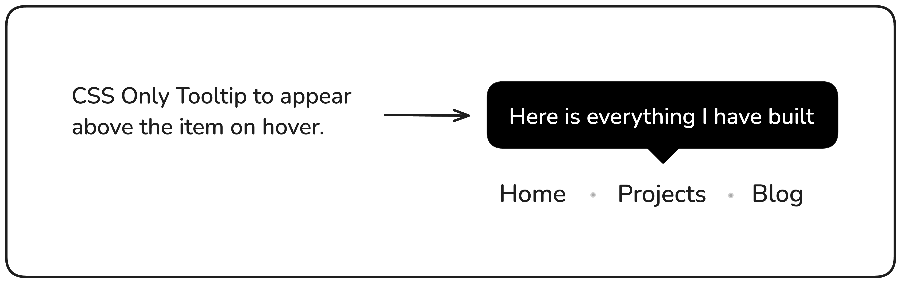
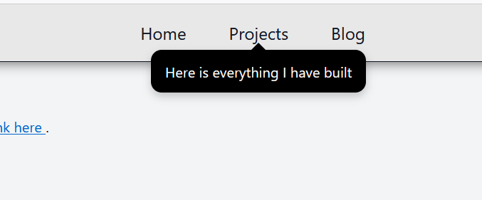

# Tooltip UI

A simple **CSS-only tooltip interface** that displays descriptive text when hovering over navigation links.  
This project was built as part of the [roadmap.sh Tooltip UI challenge](https://roadmap.sh/projects/tooltip-ui).



---

## 🚀 Project Overview

The goal of this project was to implement interactive tooltips for navigation items using only **HTML and CSS**—without JavaScript.  
When a user hovers over a navigation link (like _Home_, _Projects_, or _Blog_), a small tooltip appears below it with a smooth fade-in animation and a pointer arrow.

---

## 🧠 Features

- **CSS-only tooltip animation** - No JavaScript required
- Tooltip positioned directly **below** each nav link
- **Custom arrow** made with CSS borders
- Smooth **fade-in transitions** for better UX
- **Responsive-friendly layout**
- Clean and organized HTML & CSS structure

---

## 🧩 Technologies Used

- **HTML5**
- **CSS3** (pseudo-elements `::before` and `::after` for tooltips)
- **Flexbox** for layout alignment

---

## ⚙️ How It Works

Each navigation link (`<a>`) includes a `data-tooltip` attribute containing the tooltip text.

Using CSS pseudo-elements:

- `::before` creates the tooltip box (text bubble)
- `::after` creates the small arrow pointing up toward the link

When the user hovers over the link, both pseudo-elements fade in using CSS transitions.

---

## 🧭 Project Structure

```
tooltip-ui/
│
├── index.html          # Main HTML file
├── style.css           # Stylesheet for layout and tooltip behavior
└── assets/
    ├── tooltip.png     # Project preview image
    └── screenshot.png  # Live demo screenshot
```

---

## 📸 Screenshots

### Desktop View



_Tooltips appear smoothly below each navigation link on hover_

---

## 💪 Challenges Faced

### 1. **Positioning the Tooltip Perfectly**

At first, tooltips were misaligned and didn't sit exactly under their nav links.  
✅ **Solution:** Used `position: absolute` with `left: 50%` and `transform: translateX(-50%)` to center each tooltip horizontally relative to its parent link.

---

### 2. **Tooltip Visibility & Animation**

Initially, tooltips appeared abruptly and sometimes flickered during hover.  
✅ **Solution:** Added smooth `opacity` and `transform` transitions and ensured `pointer-events: none` was set so they didn't interfere with the hover area.

---

### 3. **Arrow Placement**

The small triangle (arrow) wasn't showing correctly under the tooltip at first.  
✅ **Solution:** Adjusted `border-color` on the `::after` pseudo-element to create an upward-pointing triangle and positioned it using precise `top` values.

---

## 🎓 Lessons Learned

- Deepened my understanding of **CSS pseudo-elements** (`::before` and `::after`) and how they can create dynamic UI elements without JavaScript
- Learned the importance of **positioning context** (`relative` vs `absolute`) for accurate element placement
- Practiced writing **clean, readable, and reusable CSS** for UI micro-interactions
- Improved my skills in creating **smooth transitions** and hover effects

---

## 🧑‍💻 Author

**Abasiomofon Udoh**  
Frontend Developer & Backend Enthusiast

🔗 [GitHub](https://github.com/omofon) · [LinkedIn](https://linkedin.com/in/omofon)

---

## 📝 License

This project is open source and available under the [MIT License](LICENSE).
